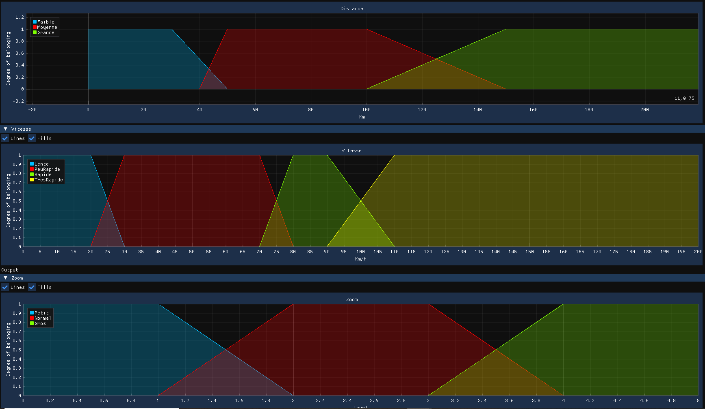

# FuzzyLogic
C++ Fuzzy logic with ImGui interface

<div style="text-align:center">
    
</div>

## Demo 
```cpp
    //FuzzyLogic
    // Creation du systeme
    writeLine("Gestion du zoom GPS", true);
    FuzzySystem system("Gestion du zoom GPS");

    writeLine("1) Ajout des variables", true);

    // Ajout de la variable linguistique "Distance" (de 0 a 500 000 m)
    writeLine("Ajout de la variable Distance");
    LinguisticVariable distance("Distance", 0.f, 500000.f, "Km");
    distance.addValue(LinguisticValue("Faible", LeftFuzzySet(0.f, 500000.f, 30.f, 50.f)));
    distance.addValue(LinguisticValue("Moyenne", TrapezoidalFuzzySet(0.f, 500000.f, 40.f, 50.f, 100.f, 150.f)));
    distance.addValue(LinguisticValue("Grande", RightFuzzySet(0.f, 500000.f, 100.f, 150.f)));
    system.addInputVariable(distance);

    // Ajout de la variable linguistique "Vitesse" (de 0 a 200)
    writeLine("Ajout de la variable Vitesse");
    LinguisticVariable vitesse("Vitesse", 0.f, 200.f, "Km/h");
    vitesse.addValue(LinguisticValue("Lente", LeftFuzzySet(0.f, 200.f, 20.f, 30.f)));
    vitesse.addValue(LinguisticValue("PeuRapide", TrapezoidalFuzzySet(0.f, 200.f, 20.f, 30.f, 70.f, 80.f)));
    vitesse.addValue(LinguisticValue("Rapide", TrapezoidalFuzzySet(0.f, 200.f, 70.f, 80.f, 90.f, 110.f)));
    vitesse.addValue(LinguisticValue("TresRapide", RightFuzzySet(0.f, 200.f, 90.f, 110.f)));
    system.addInputVariable(vitesse);

    // Ajout de la variable linguistique "Zoom" (de 0 a 5)
    writeLine("Ajout de la variable Zoom");
    LinguisticVariable zoom("Zoom", 0.f, 5.f, "Level");
    zoom.addValue(LinguisticValue("Petit", LeftFuzzySet(0.f, 5.f, 1.f, 2.f)));
    zoom.addValue(LinguisticValue("Normal", TrapezoidalFuzzySet(0.f, 5.f, 1.f, 2.f, 3.f, 4.f)));
    zoom.addValue(LinguisticValue("Gros", RightFuzzySet(0.f, 5.f, 3.f, 4.f)));
    system.setOutput(zoom);

    writeLine("2) Ajout des regles", true);

    // Creation des regles selon la matrice suivante :
    // Plus le zoom est petit, plus on voit loin (mais moins detaille)
    // V \ D  || F | M | G |
    // Lent   || N | P | P |
    // Peu Ra || N | N | P |
    // Rapide || G | N | P |
    // Tres R || G | G | P |
    system.addFuzzyRule("IF Distance IS Grande THEN Zoom IS Petit");
    system.addFuzzyRule("IF Distance IS Faible AND Vitesse IS Lente THEN Zoom IS Normal");
    system.addFuzzyRule("IF Distance IS Faible AND Vitesse IS PeuRapide THEN Zoom IS Normal");
    system.addFuzzyRule("IF Distance IS Faible AND Vitesse IS Rapide THEN Zoom IS Gros");
    system.addFuzzyRule("IF Distance IS Faible AND Vitesse IS TresRapide THEN Zoom IS Gros");
    system.addFuzzyRule("IF Distance IS Moyenne AND Vitesse IS Lente THEN Zoom IS Petit");
    system.addFuzzyRule("IF Distance IS Moyenne AND Vitesse IS PeuRapide THEN Zoom IS Normal");
    system.addFuzzyRule("IF Distance IS Moyenne AND Vitesse IS Rapide THEN Zoom IS Normal");
    system.addFuzzyRule("IF Distance IS Moyenne AND Vitesse IS TresRapide THEN Zoom IS Gros");
    writeLine("9 regles ajoutees \n");
    
    writeLine("3) Resolution de cas pratiques", true);
    // Cas pratique 1 : vitesse de 35 kms/h, et prochain changement de direction a 70m
    writeLine("Cas 1 :", true);
    writeLine("V = 35 (peu rapide)");
    writeLine("D = 70 (moyenne)");
    system.setInputVariable(vitesse, 35.f);
    system.setInputVariable(distance, 70.f);
    writeLine("Attendu : zoom normal, centroide a 2.5");
    writeLine("Resultat : " + std::to_string(system.solve()) + "\n");
    
    // Cas pratique 2 : vitesse de 25 kms/h, et prochain changement de direction a 70m
    system.resetCase();
    writeLine("Cas 2 :", true);
    writeLine("V = 25 (50% lente, 50% peu rapide)");
    writeLine("D = 70 (moyenne)");
    system.setInputVariable(vitesse, 25.f);
    system.setInputVariable(distance, 70.f);
    writeLine("Attendu : zoom normal a 50% + zoom petit a 50%");
    writeLine("Resultat : " + std::to_string(system.solve()) + "\n");

    // Cas pratique 3 : vitesse de 72.5 kms/h, et prochain changement de direction a 40m
    system.resetCase();
    writeLine("Cas 3 :", true);
    writeLine("V = 72.5 (75% peu rapide + 25% rapide)");
    writeLine("D = 40 (50% faible)");
    system.setInputVariable(vitesse, 72.5f);
    system.setInputVariable(distance, 40.f);
    writeLine("Attendu : zoom normal a 50% + zoom gros a 25%");
    writeLine("Resultat : " + std::to_string(system.solve()) + "\n");

    // Cas pratique 4 : vitesse de 100 kms/h, et prochain changement de direction a 110m
    system.resetCase();
    writeLine("Cas 4 :", true);
    writeLine("V = 100 (50% rapide + 50% tres rapide)");
    writeLine("D = 110 (80% moyenne, 20% grande)");
    system.setInputVariable(vitesse, 100.f);
    system.setInputVariable(distance, 110.f);
    writeLine("Attendu : zoom petit a 20% + zoom normal a 50% + zoom gros a 50%");
    writeLine("Resultat : " + std::to_string(system.solve()) + "\n");

    // Cas pratique 5 : vitesse de 45 kms/h, et prochain changement de direction a 160m
    system.resetCase();
    writeLine("Cas 5 :", true);
    writeLine("V = 45 (100% peu rapide)");
    writeLine("D = 160 (100% grande)");
    system.setInputVariable(vitesse, 45.f);
    system.setInputVariable(distance, 160.f);
    writeLine("Attendu : zoom petit a 100%");
    writeLine("Resultat : " + std::to_string(system.solve()) + "\n");
```

## License
MIT License

Copyright (c) 2021 Six Jonathan

Permission is hereby granted, free of charge, to any person obtaining a copy
of this software and associated documentation files (the "Software"), to deal
in the Software without restriction, including without limitation the rights
to use, copy, modify, merge, publish, distribute, sublicense, and/or sell
copies of the Software, and to permit persons to whom the Software is
furnished to do so, subject to the following conditions:

The above copyright notice and this permission notice shall be included in all
copies or substantial portions of the Software.

THE SOFTWARE IS PROVIDED "AS IS", WITHOUT WARRANTY OF ANY KIND, EXPRESS OR
IMPLIED, INCLUDING BUT NOT LIMITED TO THE WARRANTIES OF MERCHANTABILITY,
FITNESS FOR A PARTICULAR PURPOSE AND NONINFRINGEMENT. IN NO EVENT SHALL THE
AUTHORS OR COPYRIGHT HOLDERS BE LIABLE FOR ANY CLAIM, DAMAGES OR OTHER
LIABILITY, WHETHER IN AN ACTION OF CONTRACT, TORT OR OTHERWISE, ARISING FROM,
OUT OF OR IN CONNECTION WITH THE SOFTWARE OR THE USE OR OTHER DEALINGS IN THE
SOFTWARE.
